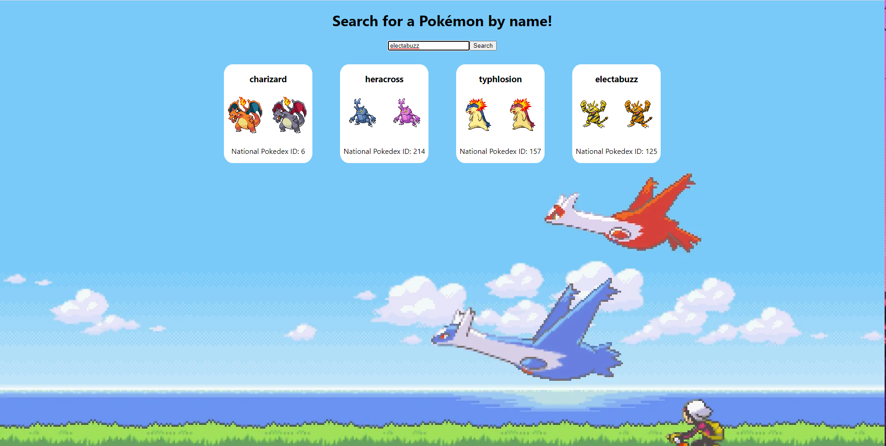

# Quick React exercise to practice using APIs and forms.

Small React exercise that allows you to search for a Pokemon by name and returns a few values through the use of the PokeAPI.

Uses three components: PokemonSearch, PokemonCardList, and PokemonCard.
* PokemonSearch is a class based component that renders a form for the user, fetches data from the API, and passes said data along to another component
* PokemonCardList is a functional component that maps through the API data
* PokemonCard is a functional component that determines what data to render, and how to display it

